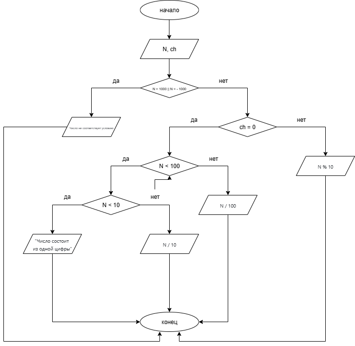

# Домашнее задание к работе 6
## Условие задачи
Дано число N (N<1000). Написать программу, которая по запросу
пользователя выведет последнюю или первую цифру введенного числа.
## 1. Алгоритм и блок-схема
### Алгоритм 
1. Начало
2. Инициализировать переменные:
   'pN' - переменная, в которой будет хранится значение введенного числа
   'ch' - переменная, в которой будет хранится значение 0 или 1 для определения, какое из условий выполнить - вывести первую или последнюю цифру
3. Ввести число с клавиатуры (записывается в переменную pN)
4. Проверка выполнения условия:
   1. Если число больше 1000 или меньше -1000, вывести "Число не соответствует условию"
   2. Иначе:
      1. Ввести 0 или 1 с клавиатуры в зависимости от того, какую цифру требуется вывести - 0 для первой цифры, 1 для последней цифры
      2. Инициализировать переменную:
      3. 'N' - абсолютное значение переменной pN (для корректного вывода цифры)
      4. Проверка выполнения условия:
         1. Если требуется вывести первую цифру (ch = 0):
            1. Если 'N' < 100:
               1. Если 'N' < 10  вывести "Число состоит из одной цифры"
               2. Иначе вывести первую цифру введенного числа (частное от деления 'N' на 10)
            2. Иначе вывести первую цифру введенного числа (частное от деления 'N' на 100)
         2. Иначе вывести последнюю цифру введенного числа (остаток от деления 'N' на 10)
5. Конец
### Блок-схема

## 2. Реализация программы 
#define _CRT_SECURE_NO_DEPRECATE
#include <stdio.h>
#include <locale.h>
#include <math.h>

int main()
{
    setlocale(LC_CTYPE, "RUS");
    int pN, ch;
    puts("Введите число (меньше 1000):");
    scanf("%d", &pN);
    if (pN > 1000 || pN < -1000) puts("Число не соответствует условию");
    else {
        int N = fabs(pN);
        puts("Вы хотите вывести первую или последнюю цифру числа? (0 - первую, 1 - последнюю)");
        scanf("%d", &ch);
        if (ch == 0)
        {
            if (N < 100) {
                if (N < 10) puts("Число состоит из одной цифры");
                else printf("Первая цифра введенного числа %d", N / 10);
            }
            else printf("Первая цифра введенного числа %d", N / 100);
        }
        else printf("Последняя цифра введенного числа %d", N % 10);
    }
    return 0;
}
## 3. Результат работы программы
### Число, большее 1000 или меньшее -1000
Введите число (меньше 1000):
1123
Число не соответствует условию
### Число, меньшее 10
Введите число (меньше 1000):
5
Вы хотите вывести первую или последнюю цифру числа? (0 - первую, 1 - последнюю)
0
Число состоит из одной цифры
### Число, меньшее 100, первая цифра
Введите число (меньше 1000):
45
Вы хотите вывести первую или последнюю цифру числа? (0 - первую, 1 - последнюю)
0
Первая цифра введенного числа 4
### Число, меньшее 100, последняя цифра
Введите число (меньше 1000):
45
Вы хотите вывести первую или последнюю цифру числа? (0 - первую, 1 - последнюю)
1
Последняя цифра введенного числа 5
### Число, большее 100
Введите число (меньше 1000):
890
Вы хотите вывести первую или последнюю цифру числа? (0 - первую, 1 - последнюю)
0
Первая цифра введенного числа 8
### Отрицательное число
Введите число (меньше 1000):
-345
Вы хотите вывести первую или последнюю цифру числа? (0 - первую, 1 - последнюю)
0
Первая цифра введенного числа 3
## 4. Информация о разработчике
Вильальба Агния, группа бТИИ-251
